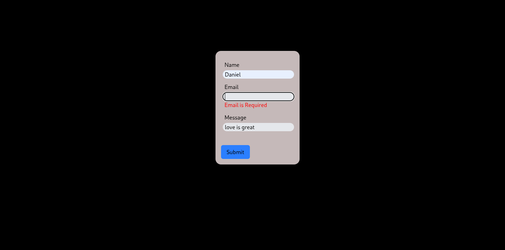

# Simple Contact Form App

A simple, responsive contact form built with **React**, **TypeScript**, **Vite**, **React Hook Form**, and **Tailwind CSS**.

## 🚀 Features

* **Fields**: Name, Email, Message (all required)
* **Validation**: Real-time validation for required fields and email format
* **Submission**: Logs submitted data to the browser console
* **Styling**: Mobile-first, responsive design with Tailwind utilities

## 📸 Demo Screenshots

> *(Add screenshots of your form in various states: empty, with validation errors


### 🔍 Empty Name


### 🔍 Empty Name



⚠️ Validation Errors


### 🔍 Empty message


## 🛠️ How to Run Locally

> Ensure you have **Node.js** and **npm** installed.

```bash
# Clone the repo
git clone https://github.com/your-username/task5-contact-form.git
cd Task5

# Install dependencies
npm install

# Start development server
npm run dev
```

Then open `http://localhost:3000` in your browser.


*Created as part of A2SV Front-end Task 5: Contact Form Implementation.*
